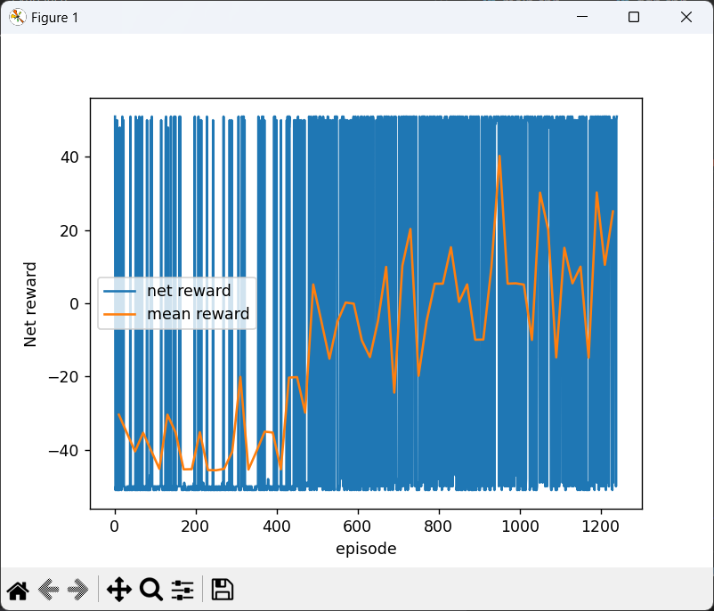
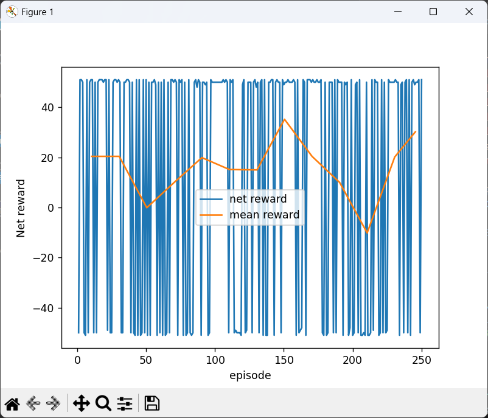
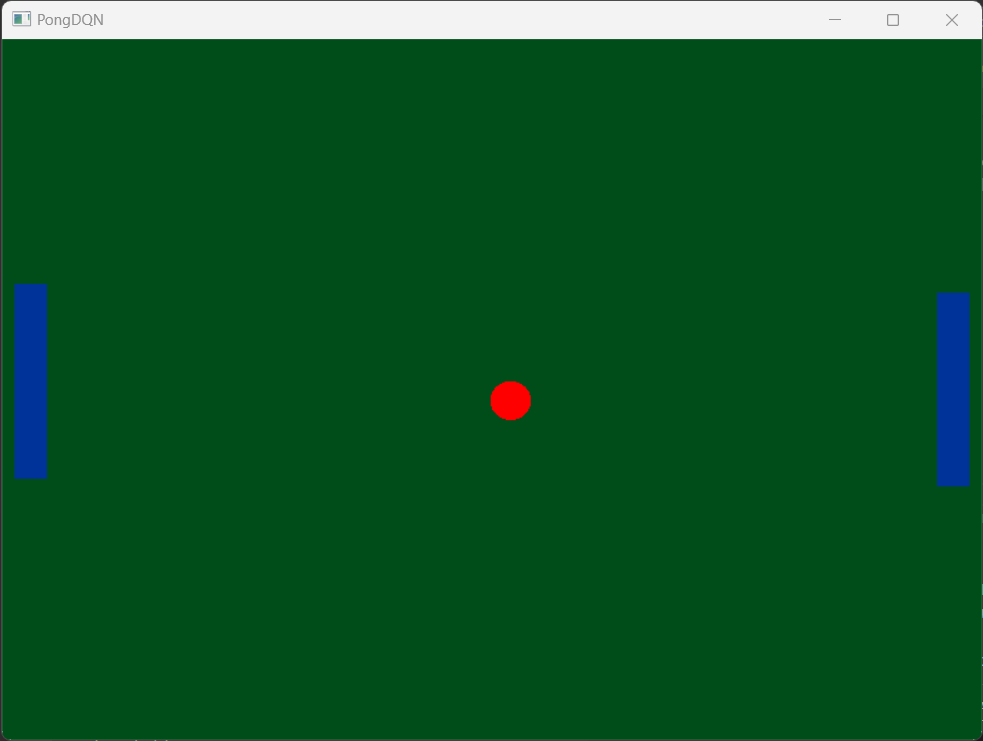
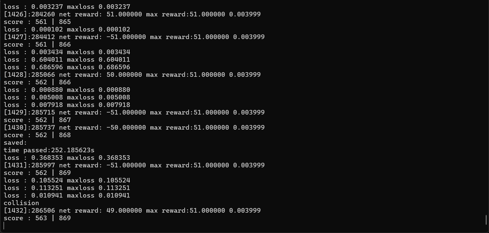
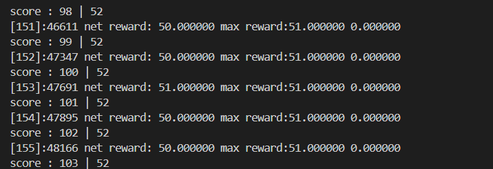

# PongDQN
## Introduction
Experimental implementaion of the Double DQN algorithm in C++ from scratch to train it on custom Pong environment. DQN agent learns to play Pong by playing against computer opponents using inputs from RAM. Pong environment is rendered using OpenGL with Win32 API for window and context creation. DQN library uses a simple neural network library implimented from scratch, a custom math library supporting vectors and matrices.

DQN agent learns to hold its own against chaser AI even if max vertical speed of paddle is less than max vertical speed of ball in about 400 episodes (approx 1 min on i5 11th gen at 3 GHz).

## Results
<table>
  <tr> <td></td>
  <td></td>
  </tr>
  <tr><th>Training Log</th><th>Testing Log</th></tr>
</table>

## Running demonstration
A x86-64 binary is provided in [bin](PongDQN/bin/) folder for demonstration purpose. After running this library a pre-trained DQN agent (left) will play with a simple chaser algorithm (right). User can use controls specified in this document to control demo.
## Controls
<ol>
  <li>M</li>
  To speed up the environment.
  <li>L</li>
  To log the model as cache.
  <li>P</li>
  Pause the application. To continue press enter on terminal. (Application uses blocking I/O call for pausing instead of busy waiting)
</ol>

## Config
Before compiling application their are some configurations that should be made in [main.cpp](PongDQN/src/main.cpp) according to the needs.
<ol>
  <li>OPPONENT AI</li>
  <ol>
    <li>BOT_CHASER</li>
    A simple chaser AI as opponent on DQN agent. It alway tries to follow ball to hit at center of paddle.
    <li>BOT_EDGE</li>
    Slightly chalanging AI which has 50-50% probability to hit ball at center or hitting ball at edge. 
    <li>PLAYER</li>
    Player can play as opponent using mouse.
    <li>BOT_AGENT</li>
    A second pre-trained DQN agent which can be used to play against agent on left.
  </ol>
  <li>TRAIN</li>
  If you want to train the model uncomment the define statement.
  <li>MODEL_ID</li>
  ID of model, which will be used in filename of model saved during traing,training log and testing log.
</ol>

  You can change model to be loaded for each agent in [main.cpp](PongDQN/src/main.cpp). (Search for comment "Load model")
## Building code
(This project only supports windows as UI and OpenGL initialization uses Windows APIs)
* using vscode: After downloading repo simply open PongDQN folder in vscode. After adjusting configurations according to need simply run the task provided in [.vscode/task.json](PongDQN/.vscode/task.json). Binary will be created in bin folder.
## Modules
This repository contains 6 libraries that are implemented from scratch in C++:
<ol type="i">
  <li>Mathlib:</li>
  A simple math library containing implementation of vectors and matrix which is used to implement neural networks.
  <li>Neurallib:</li>
  A simple neural network library containing implementation of deep neural networks, activation functions and loss functions which is used to implement DQN agent.
  <li>Gymlab:</li>
  A simple gym environment library for RL agents containing implementation of PONG environment which is used alongside DQN agent to train it.
  <li>Uilib:</li>
  A simple UI library(windows) for creating windows which can be used for rendering.
  <li>Renderlib:</li>
  A simple rendering library for rendering gym environment for human understanding. It provides way to draw simple 2d shapes using OpenGL API.
  <li>Rllib:</li>
  A simple reinforcement learning library containing implementation of DQN algorithm.
</ol>

## Screenshots

<table>
  <tr> <td align="center"></td></tr>
  <tr><th>Pong environment</th></tr>
  <tr> <td align="center"></td></tr>
  <tr><th>Training log</th></tr>
  <tr> <td align="center"></td></tr>
  <tr><th>Test log</th></tr>
</table>
